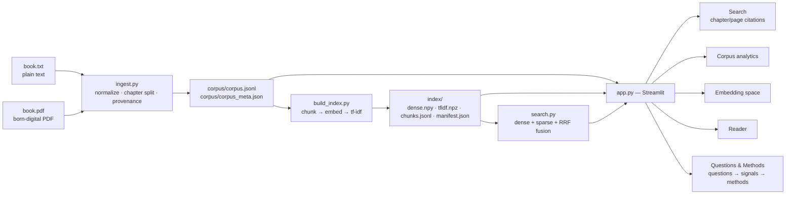

# Harry Potter Corpus Explorer

An end-to-end pipeline that turns a book into a searchable, explorable corpus:
**ingest → chapter-aware corpus records → chunk + embed + sparse index → hybrid
retrieval → interactive Streamlit tool**. The input is a local plain-text Harry
Potter book (`.txt`); a born-digital PDF adapter takes the same path. The book
text is never committed — you supply your own copy and build the corpus locally.

The tool exposes six corpus attributes, all extracted from the real book:
chapter structure, vocabulary, dialogue share, character presence, sentiment
trajectory, and semantic/retrieval structure.

---

## High-level description

A book is not a bag of words. It has chapter boundaries, speakers, an emotional
arc, a vocabulary that grows and narrows, and passages that answer questions the
reader can phrase but not locate. This project extracts those attributes into a
single normalized representation and puts them behind one interactive tool.

Design in one sentence: **one ingestion path, one canonical corpus record, one
calculation per attribute, and every retrieval hit traceable to a chapter (and a
page when the source has pages).**

What it does:

| Step | Module | Output |
|---|---|---|
| Ingest `.txt` or `.pdf` → normalized chapters | `ingest.py` | `corpus/corpus.jsonl`, `corpus/corpus_meta.json` |
| Chunk (sentence-aware) + embed + TF-IDF | `build_index.py` | `index/dense.npy`, `index/tfidf.npz`, `index/chunks.jsonl`, `index/manifest.json` |
| Retrieve: dense, sparse, hybrid RRF, filters | `search.py` | ranked hits with citations |
| Explore: search, analytics, embedding map, reader | `app.py` | Streamlit app on `http://localhost:8501` |
| Measure retrieval quality (optional) | `evaluate.py` | Hit@1 / Hit@3 / MRR per mode |

---

## Usage

### 1. Install

```bash
python -m venv .venv
# Windows: .venv\Scripts\activate    |    macOS/Linux: source .venv/bin/activate
pip install -r requirements.txt
```

### 2. Supply the book (not included in this repo)

```bash
mkdir -p data/raw
# copy your own copy of the book text to:
#   data/raw/book.txt          (plain text — the primary input)
# or
#   data/raw/book.pdf          (born-digital PDF — optional adapter)
```

`data/`, `*.pdf`, `corpus/`, `out/`, `index*/` are gitignored. Nothing derived
from the book text is committed.

### 3. Build the corpus and the index

```bash
python ingest.py data/raw/book.txt corpus        # → 17 chapters, 78,657 words
python build_index.py corpus index               # → 501 chunks, 384-d dense, ~200 s CPU
```

The PDF adapter is the same command with the PDF path:

```bash
python ingest.py data/raw/book.pdf corpus_pdf    # → 250 pages, 17 chapters
python build_index.py corpus_pdf index_pdf
```

### 4. Run the tool

```bash
streamlit run app.py
```

Environment overrides (all optional):

| Variable | Default | Meaning |
|---|---|---|
| `CORPUS_DIR` | `corpus` | corpus records to read |
| `CORPUS_INDEX_DIR` | `index` | index to read |
| `CORPUS_ENCODER` | *(unset)* | `hashing` forces the offline fallback encoder (no model download) |

### 5. Command-line retrieval

```bash
python search.py "the lamp burning"              # all three modes, top 3 each
python search.py "wingardium leviosa" index      # explicit index directory
```

### 6. Tests

```bash
python -m pytest tests -q
```

Tests run on an original synthetic novella built at test time — no book text, no
model download (`CORPUS_ENCODER=hashing`).

---

## Flow diagram



---

## Why these attributes?

Each attribute started as a question a reader might ask about a novel, then had
to be measurable, traceable to the source, and complementary to the others. The
same reasoning is stated inside the tool, in the **🧭 Questions & Methods** tab.

| Question | Signal | Extraction method | Caveat |
|---|---|---|---|
| How does the pacing change through the book? | chapter length, average sentence length, dialogue share, unique vocabulary | chapter segmentation; token and sentence counts; quotation-span counting; vocabulary statistics | describes form, not why a chapter feels fast or slow |
| Which characters dominate different parts of the story? | character presence by chapter | curated character-presence lexicon, exact word-boundary matching | aliases, pronouns and ambiguous surnames are not fully resolved; a presence counter, **not** NER |
| How does emotional tone change across the narrative? | chapter-level sentiment trajectory | sentence-level VADER compound scores aggregated by chapter | lexicon-based proxy, not an emotion model or ground truth |
| How is meaning distributed through the book, and how can a reader retrieve it? | sentence-aware chunks, dense embeddings, TF-IDF sparse, RRF, PCA map | chunking → `bge-small-en-v1.5` (384-d) + TF-IDF 1–2 grams → RRF → PCA-2 | PCA is a 2-D projection and should not be read as a faithful map of all high-dimensional relationships |

Selection principles: **reader-relevant** (answers a question about the story or
writing), **extractable** (computable from the corpus, not inferred without
evidence), **traceable** (chapter/page provenance retained), **complementary**
(structural, lexical, affective and semantic signals cover different aspects of
the same corpus).

---

## Corpus attributes and extraction methods

Every visible attribute has one identifiable extraction method and one place in
the code where it is computed.

| Attribute | What it shows | Extraction method | Where |
|---|---|---|---|
| **Chapter structure** | chapters, words/paragraphs per chapter, chapter-length profile | PDF: PyMuPDF TOC entries → page ranges → block text; TXT: `CHAPTER <word/number>` heading regex | `ingest.chapters_from_pdf` / `chapters_from_txt` |
| **Vocabulary / lexical stats** | unique words, type–token ratio, most frequent content words | token regex + frequency count, English stopword list, chapter-level aggregation | `app.py` analytics tab |
| **Dialogue share** | % of words inside double quotes, per chapter and corpus-wide | one regex (`"[^"]+"`) over typographically normalized text; computed **once** in `ingest.py` and stored in `corpus_meta.json` | `ingest.dialogue_words` |
| **Character presence** | mentions of 26 named characters per chapter | fixed whole-word presence lexicon — a mention counter, **not** NER | `app.CHARACTER_PRESENCE` |
| **Sentiment trajectory** | VADER compound score per chapter | sentence-sampled VADER sentiment, averaged per chapter | `app.chapter_sentiment` |
| **Semantic / retrieval structure** | 2-D PCA of chunk embeddings, nearest chunks, hybrid retrieval | fastembed ONNX embeddings (`bge-small-en-v1.5`, 384-d) + PCA; TF-IDF 1–2 grams for sparse | `build_index.py`, `app.pca_map` |

Why these six: they span three different levels — *document structure*
(chapters), *surface language* (vocabulary, dialogue), *narrative content*
(characters, sentiment), and *meaning* (embeddings). Each is cheap to compute on
a 78k-word book, and each is directly inspectable by a reader.

---

## Architecture and data flow

**One ingestion path, one record shape.** `ingest.py` normalizes typographic
punctuation (curly quotes, en/em dashes, ellipses, NBSP) so one set of regexes
works on both inputs, then produces chapter records:

```json
{"chapter_index": 1, "title": "CHAPTER ONE", "pages": [10, 24],
 "paragraphs": 92, "words": 4203, "text": "...", "dialogue_words": 1830}
```

`pages` is a page range for PDF input and `null` for plain text — citations
adapt, downstream code does not branch.

**PDF adapter.** PyMuPDF block geometry (reading order, not raw text order),
page-furniture removal (isolated short numeric blocks near the page edge),
cross-page paragraph stitching (a paragraph that continues on the next page is
rejoined), TOC-aware chapter boundaries, and line-break hyphen repair.

**Chunking.** ~1,000 characters, sentence-aligned, one sentence of overlap,
tagged with chapter index, chapter title, page range, and position within the
chapter. Sentence alignment keeps a chunk about one idea; the overlap stops an
answer from being lost exactly at a boundary.

**Index.** Dense: fastembed ONNX `bge-small-en-v1.5`, 384-d, L2-normalized, CPU.
Sparse: TF-IDF word 1–2 grams, sublinear TF, English stopwords. Both are stored
plain (`numpy` + `scipy.sparse`); at ~500 chunks an ANN library would be unearned
infrastructure, so dense search is exact.

**Retrieval.** `dense` (cosine), `sparse` (TF-IDF cosine), or `hybrid` — rank
fusion (RRF, k=60) of the two lists, which needs no score calibration between
modalities. Metadata filters (`chapter`, `page`) are applied to the candidate set
before ranking, so a filtered search can never return an out-of-filter chunk
(tested).

**Provenance.** Every chunk carries `id`, `chapter_index`, `chapter`, `pages`,
`chunk_in_chapter`. Every hit carries a citation string — `CHAPTER SEVEN
(pp. 92-101), chunk 3` for PDF input, `CHAPTER SEVEN, chunk 3` for plain text.

---

## Core questions and answers

### What interesting attributes did you choose, and why?

Chapter structure (how the book is built), vocabulary and dialogue share (how its
language behaves), character presence and sentiment (what happens in it), and the
embedding space (what it *means*). These six are the attributes a reader can
argue about, which makes them good demo material — and each is computable from
the text alone, with no external service.

### How are they extracted?

See the table above. The rule is one calculation per attribute in one place:
dialogue share is computed in `ingest.py`, stored in `corpus_meta.json`, and the
UI reads that stored value — the README, the app, and the test all assert the
same number, so they cannot drift.

### Why PyMuPDF when PDF input is used?

Speed and geometry. Measured on this 250-page book: PyMuPDF `get_text("blocks")`
0.16 s (~1,565 pages/s) versus pypdf 2.5 s (100 pages/s) and pdfplumber 10.4 s
(24 pages/s); OCR-style tools (Marker, MinerU, olmOCR) take 2–15 minutes per
book. PyMuPDF also exposes block coordinates (so reading order and page furniture
can be handled) and the PDF's own table of contents, which is what makes
TOC-aware chapter boundaries possible.

### How does plain-text input work?

`python ingest.py data/raw/book.txt corpus`. The text is normalized with the same
function the PDF path uses, Project Gutenberg start/end markers are stripped, and
chapters are split on `CHAPTER <word|number|roman>` headings. If no headings are
found, the file becomes a single chapter rather than failing. Records are
byte-for-byte the same shape as PDF records, so chunking, indexing, retrieval and
analytics are input-agnostic — there is no second pipeline.

### Why this chunking strategy?

Sentence-aligned, ~1,000-character chunks with one sentence of overlap. Sentence
boundaries keep a chunk semantically single-purpose; the character budget keeps it
inside the embedding model's effective window; the overlap prevents an answer from
being split across two chunks and lost by both. Chapter tags on every chunk are
what make citations possible at all.

### Why sparse + dense retrieval?

They fail differently. Sparse (TF-IDF) matches exact rare terms — invented words
like *Wingardium*, or a character's name — where dense embeddings blur them.
Dense matches paraphrase and theme where no query word appears in the passage.
Measured on this corpus (12 labelled queries, see *Measured retrieval quality*),
sparse is the stronger of the two because the query set is name-heavy — exactly
the regime where exact term matching wins. Dense exists for the other regime: a
paraphrase query that shares no rare term with the passage that answers it.

### What does hybrid/RRF add?

A single ranked list that gets both behaviours without calibrating two score
scales. RRF (k=60) fuses by *rank*, so a passage found by only one method still
surfaces, and a passage found by both rises. Ties break on chunk id, so results
are deterministic (tested). Measured here, hybrid (Hit@1 0.75) sits between
sparse (0.92) and dense (0.58): rank fusion cannot invent signal that neither
list has, and when one list is much stronger it can dilute it. Hybrid is
insurance against the query with no rare term, not a guaranteed improvement.

### How are citations/provenance preserved?

Provenance is created at chunking time and never reconstructed later: each chunk
is written with chapter index, chapter title, page range (PDF only) and position
in chapter. Retrieval returns that record plus a formatted citation; the UI shows
it above the passage. No chunk can exist without provenance — `chunks.jsonl` is
the only source the searcher reads.

### What does character presence mean?

It means *mentions of a fixed list of 26 character names, matched as whole
words*. It is a presence lexicon, not named-entity recognition: it will count
"Harry" in "Harry's" but it cannot discover an unnamed speaker, and a common word
that is also a name would need to be excluded by hand. This is stated in the UI
next to the chart, not buried in the code.

### What are the limitations?

See the Limitations section below. The honest summary: heuristics, one book at a
time, no speaker attribution, no NER, and the PDF adapter's de-hyphenation has one
known miss in this book.

### Why isn't the Harry Potter text committed?

It is copyrighted. The repository ships the *pipeline*, not the book: you supply
your own copy at `data/raw/book.txt`, and `.gitignore` excludes the source text,
the normalized corpus, and every derived artifact that contains passages. Anyone
cloning this repo can reproduce the results with their own copy and gets no
copyrighted content from it.

### How would this extend to more books?

`ingest.py` is already format-agnostic and takes an arbitrary input path, so the
work is book management, not pipeline surgery: one corpus directory per book, a
book id on every record, and an index that namespaces chunk ids per book. The
searcher would then filter by book the same way it filters by chapter today.

### What would you improve with more time?

Speaker attribution for dialogue (who says each quote), lightweight automatic
entity discovery to replace the fixed character list, page-anchored citations for
plain-text input by mapping offsets back to a PDF when one exists, a chunk-size
sweep against the evaluation harness, and an ANN index once the corpus is large
enough to need one.

---

## Measured retrieval quality

`python evaluate.py eval/queries.jsonl index` — 12 labelled queries against the
plain-text corpus (501 chunks). A query counts as answered when a retrieved chunk
contains its target string; every target string was verified to occur in the
corpus, and a query whose target is absent is reported as *broken* rather than
silently scored as a miss (all 12 are usable).

| mode | Hit@1 | Hit@3 | MRR |
|---|---|---|---|
| sparse (TF-IDF) | 0.92 | 1.00 | 0.94 |
| hybrid (RRF) | 0.75 | 0.83 | 0.78 |
| dense (bge-small 384-d) | 0.58 | 0.75 | 0.67 |

Reading this honestly: the query set is deliberately name-heavy ("the sorting
hat", "Wingardium Leviosa", "Gringotts"), which is the regime where exact term
matching wins and a small 384-d embedding model does not. The dense misses are
the paraphrase-shaped queries with no rare term. RRF sits between the two because
it can only fuse the signal its inputs provide. This is a property of the query
mix, not a claim that hybrid retrieval is worse in general — a paraphrase-only set
would move the dense column up. The harness ships in the repo so the claim can be
re-run rather than taken on faith.

## Limitations

- **Character presence is a lexicon, not NER.** A fixed 26-name list; no
  discovery, no coreference, no speaker attribution.
- **Sentiment is a proxy.** VADER compound scores over sampled sentences are a
  rough emotional trajectory, not a literary reading.
- **Plain-text input has no page numbers.** Citations are chapter + chunk. Page
  ranges exist only when the source is a PDF with a TOC.
- **Heuristics are English- and format-specific.** Chapter headings must match
  `CHAPTER <word|number|roman>`; a book without them becomes one chapter.
- **De-hyphenation has one known miss** in this book (`booger-\nflavored`), one
  token out of 78,657 words.
- **Exact dense search.** Fine at ~500 chunks; would need an ANN index at
  100k+ chunks.
- **One book per corpus directory.** No multi-book index yet.
- **No incremental re-index.** Changing the corpus means re-running
  `build_index.py`.

---

## Copyright and data handling

The book text is copyrighted and is **not** part of this repository.

- `.gitignore` excludes `*.pdf`, `data/`, `corpus/`, `out/`, `index/`, `index_pdf/`.
- No source passages, reconstructed chapters, or chunk text are committed.
- `corpus/corpus_meta.json` contains only counts and titles, no text.
- To reproduce: bring your own legally obtained copy of the book to
  `data/raw/book.txt` and run the three commands in Usage.

---

## Tests

`python -m pytest tests -q` — 10 tests over an original synthetic novella
generated at test time (title page + three chapters), so the suite needs no book
text and no model download.

They cover the load-bearing behaviour:

- a front-matter TOC node is **not** a chapter (3 chapters in, 3 chapters out);
- page-number furniture is removed, line-break hyphens repaired;
- a paragraph split across a page break is stitched back together;
- `.txt` and `.pdf` produce the same record shape (one downstream path);
- the dialogue share in `corpus_meta.json` equals a recomputation from the
  corpus records (one canonical calculation);
- every chunk carries complete provenance;
- a chapter filter never leaks a chunk from another chapter;
- RRF ranking is deterministic;
- every hit carries a citation;
- the Streamlit app renders and displays the canonical dialogue share.

---

## Video demo

**Video:** _to be linked here_ — recorded after the app, README and flow diagram
were complete.

Shot list (90–120 s): app opens on the corpus header → search a query → switch
sparse / dense / hybrid → show the chapter citation → analytics tab (chapter
lengths, dialogue share, character presence, sentiment trajectory) → embedding
map → Reader → `pytest` output in the terminal.

---

## Repository layout

```
ingest.py          plain text or PDF → corpus/corpus.jsonl + corpus_meta.json
build_index.py     corpus records → chunks, dense vectors, TF-IDF matrix
search.py          dense / sparse / hybrid RRF retrieval with citations
app.py             Streamlit tool: Search · Analytics · Embedding space · Reader
evaluate.py        retrieval evaluation (Hit@1 / Hit@3 / MRR per mode)
eval/queries.jsonl labelled queries for evaluate.py
tests/             synthetic-corpus tests (no book text, no model download)
requirements.txt   pinned dependencies
```
